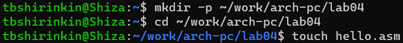
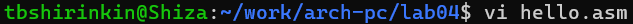
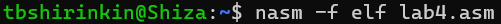

---
## Front matter
title: "Отчет по лабораторной работа №4"
subtitle: "Дисциплина: архитектура компьютера"
author: "Ширинкин Т. Б."

## Generic otions
lang: ru-RU
toc-title: "Содержание"

## Bibliography
bibliography: bib/cite.bib
csl: pandoc/csl/gost-r-7-0-5-2008-numeric.csl

## Pdf output format
toc: true # Table of contents
toc-depth: 2
lof: true # List of figures
lot: true # List of tables
fontsize: 12pt
linestretch: 1.5
papersize: a4
documentclass: scrreprt
## I18n polyglossia
polyglossia-lang:
  name: russian
  options:
    - spelling=modern
    - babelshorthands=true
polyglossia-otherlangs:
  name: english
## I18n babel
babel-lang: russian
babel-otherlangs: english
## Fonts
mainfont: PT Serif
romanfont: PT Serif
sansfont: PT Sans
monofont: PT Mono
mainfontoptions: Ligatures=TeX
romanfontoptions: Ligatures=TeX
sansfontoptions: Ligatures=TeX,Scale=MatchLowercase
monofontoptions: Scale=MatchLowercase,Scale=0.9
## Biblatex
biblatex: true
biblio-style: "gost-numeric"
biblatexoptions:
  - parentracker=true
  - backend=biber
  - hyperref=auto
  - language=auto
  - autolang=other*
  - citestyle=gost-numeric
## Pandoc-crossref LaTeX customization
figureTitle: "Рис."
tableTitle: "Таблица"
listingTitle: "Листинг"
lofTitle: "Список иллюстраций"
lotTitle: "Список таблиц"
lolTitle: "Листинги"
## Misc options
indent: true
header-includes:
  - \usepackage{indentfirst}
  - \usepackage{float} # keep figures where there are in the text
  - \floatplacement{figure}{H} # keep figures where there are in the text
---

# Цель работы

Освоить процедуру компиляции и сборки программ на ассемблере.

# Выполнение лабораторной работы

Создаём и заходим в каталог для работы с программами на языке ассемблера NASM, после чего создаём файл hello.asm (Рис. [-@fig:000])

{#fig:000 width=70%}

Открываем файл в редакторе vi (Рис. [-@fig:001])

{#fig:001 width=70%}

Вводим код (Рис. [-@fig:002])

{#fig:002 width=70%}

Превращаем вписанный код в .o файл (Рис. [-@fig:003])

{#fig:003 width=70%}

Проверяем трансмутацию (Рис. [-@fig:004])

{#fig:004 width=70%}

Вводим команду для расширенной компилляции кода и смотрим корректность компилляции (Рис. [-@fig:005])

{#fig:005 width=70%}

Компонуем hello.o (Рис. [-@fig:006])

{#fig:006 width=70%}

И obj.o (Рис. [-@fig:007])

{#fig:007 width=70%}

Запускаем программу (Рис. [-@fig:008])

{#fig:008 width=70%}

И вторую программу, понимаем, что они внешне одинаково работают (Рис. [-@fig:009])

{#fig:009 width=70%}

# Выполнение заданий для самостоятельной работы

Копируем файл (Рис. [-@fig:010])

{#fig:010 width=70%}

Открываем файл для редактирования (Рис. [-@fig:011])

{#fig:011 width=70%}

Редактируем файл (Рис. [-@fig:012])

{#fig:012 width=70%}

Компиллируем файл (Рис. [-@fig:013])

{#fig:013 width=70%}

Компонуем файл и запускаем: работает (Рис. [-@fig:014])

{#fig:014 width=70%}

Компонуем файл и запускаем: работает (Рис. [-@fig:015])

{#fig:015 width=70%}
# Выводы

Цель достигнута: освоена процедура компиляции и сборки программ на ассемблере.