---
## Front matter
title: "Отчет по лабораторной работа №7"
subtitle: "Дисциплина: архитектура компьютера"
author: "Ширинкин Т. Б."

## Generic otions
lang: ru-RU
toc-title: "Содержание"

## Bibliography
bibliography: bib/cite.bib
csl: pandoc/csl/gost-r-7-0-5-2008-numeric.csl

## Pdf output format
toc: true # Table of contents
toc-depth: 2
lof: true # List of figures
lot: true # List of tables
fontsize: 12pt
linestretch: 1.5
papersize: a4
documentclass: scrreprt
## I18n polyglossia
polyglossia-lang:
  name: russian
  options:
    - spelling=modern
    - babelshorthands=true
polyglossia-otherlangs:
  name: english
## I18n babel
babel-lang: russian
babel-otherlangs: english
## Fonts
mainfont: PT Serif
romanfont: PT Serif
sansfont: PT Sans
monofont: PT Mono
mainfontoptions: Ligatures=TeX
romanfontoptions: Ligatures=TeX
sansfontoptions: Ligatures=TeX,Scale=MatchLowercase
monofontoptions: Scale=MatchLowercase,Scale=0.9
## Biblatex
biblatex: true
biblio-style: "gost-numeric"
biblatexoptions:
  - parentracker=true
  - backend=biber
  - hyperref=auto
  - language=auto
  - autolang=other*
  - citestyle=gost-numeric
## Pandoc-crossref LaTeX customization
figureTitle: "Рис."
tableTitle: "Таблица"
listingTitle: "Листинг"
lofTitle: "Список иллюстраций"
lotTitle: "Список таблиц"
lolTitle: "Листинги"
## Misc options
indent: true
header-includes:
  - \usepackage{indentfirst}
  - \usepackage{float} # keep figures where there are in the text
  - \floatplacement{figure}{H} # keep figures where there are in the text
---

# Цель работы

Изучение команд условного и безусловного переходов в Nasm, условий порядка и изучение структуры листинга.

# Выполнение лабораторной работы

Создал каталог и первый файл (Рис. [-@fig:000])

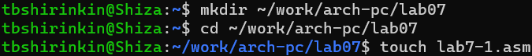{#fig:000 width=70%}

Ввёл первый листинг (Рис. [-@fig:001])

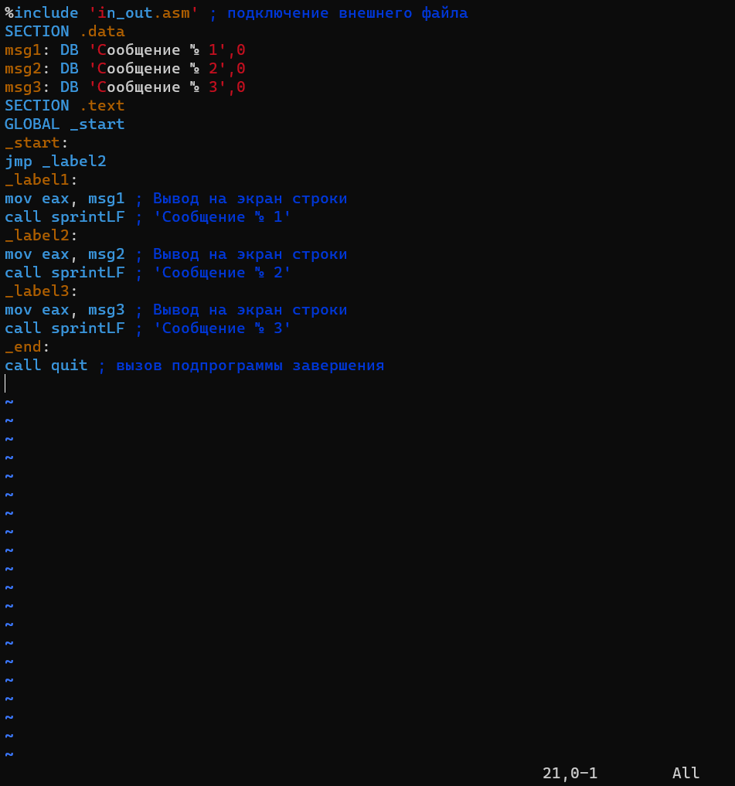{#fig:001 width=70%}

Создал исполняемый файл и запустил его (Рис. [-@fig:002])

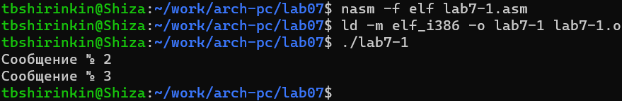{#fig:002 width=70%}

Изменяю файл в соответствии со вторым листингом (Рис. [-@fig:003])

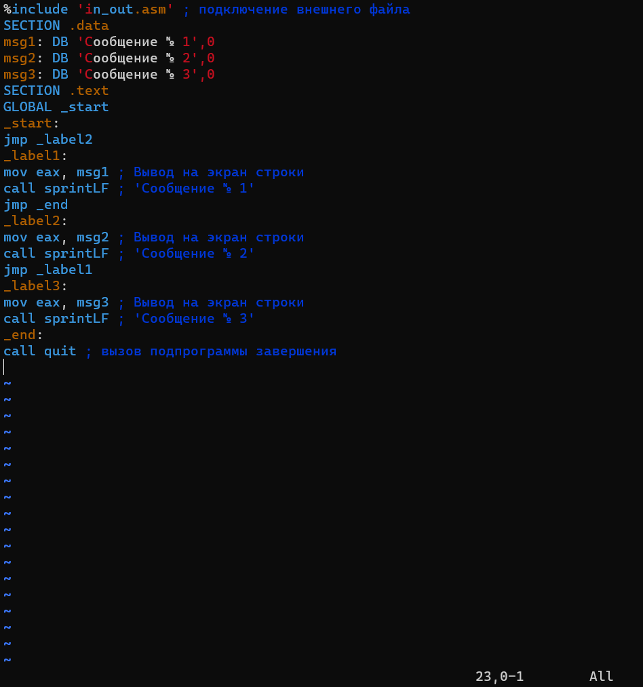{#fig:003 width=70%}

Да, из-за переходов не показалась третья строка (Рис. [-@fig:004])

{#fig:004 width=70%}

Изменил код в соответствии с заданием (Рис. [-@fig:005])

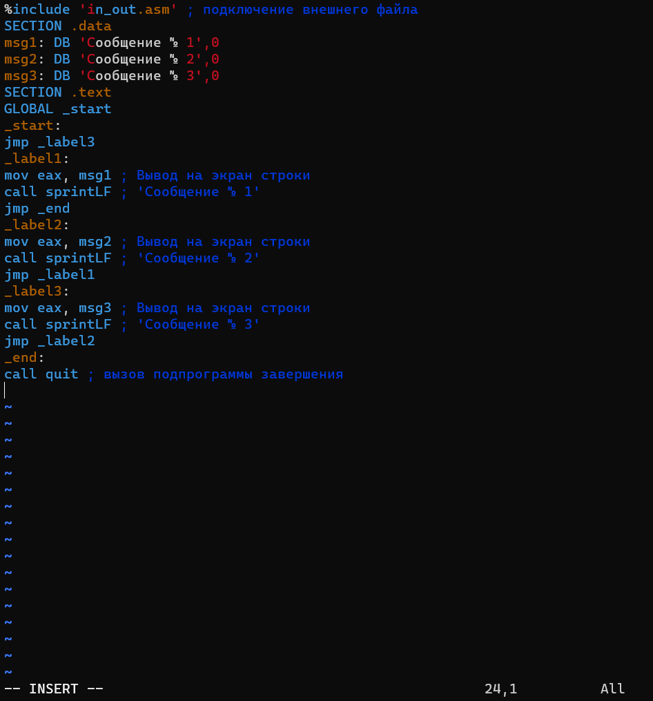{#fig:005 width=70%}

Правда работает (Рис. [-@fig:006])

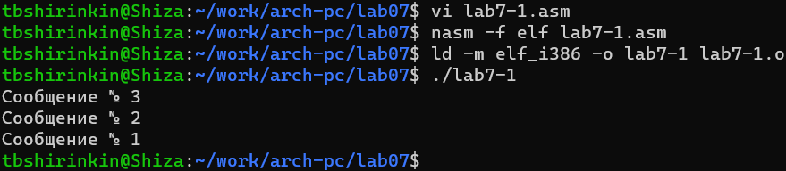{#fig:006 width=70%}

Создал новый файл (Рис. [-@fig:007])

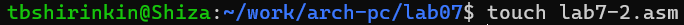{#fig:007 width=70%}

Ввёл в него новый листинг (Рис. [-@fig:008])

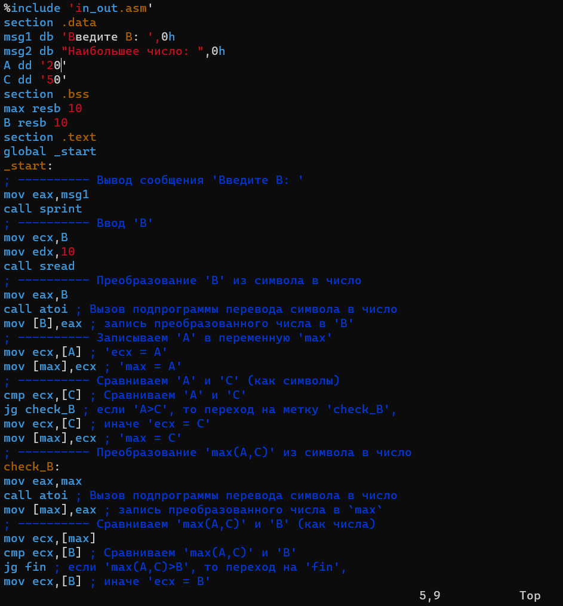{#fig:008 width=70%}

Протестировал код на разных вводных значениях - работает в соответствии с написанным кодом. (Рис. [-@fig:009])

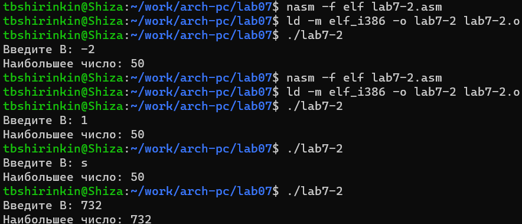{#fig:009 width=70%}

Создвл файл lst (Рис. [-@fig:010])

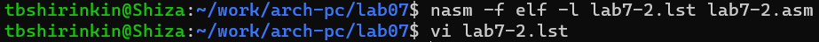{#fig:010 width=70%}

Посмотрел (Рис. [-@fig:011])

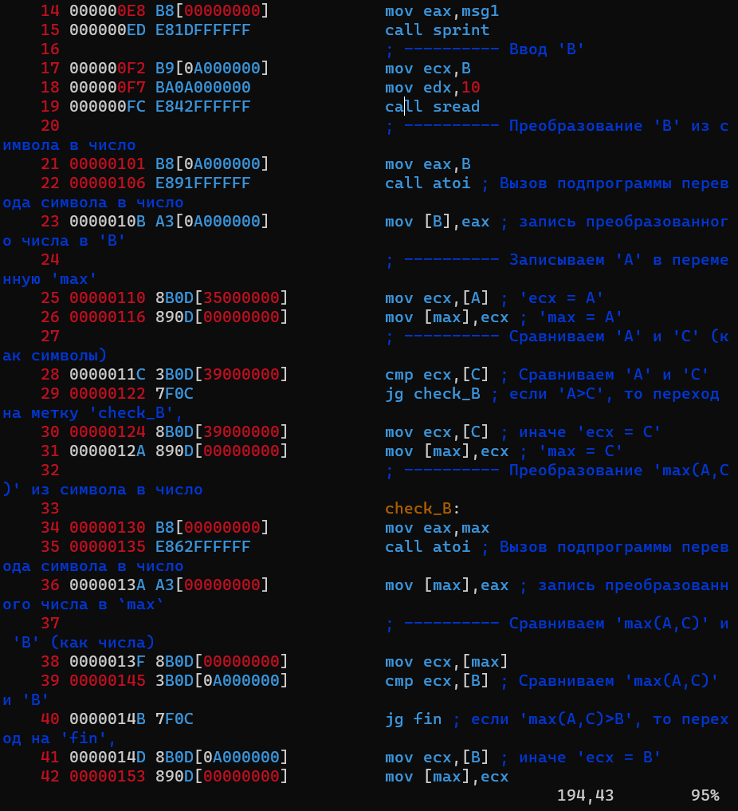{#fig:011 width=70%}

Заменил в соответствии с заданием (Рис. [-@fig:012])

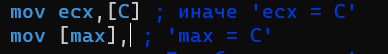{#fig:012 width=70%}

Ошибка (Рис. [-@fig:013])

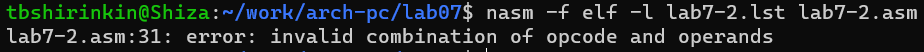{#fig:013 width=70%}

# Выполнение заданий для самостоятельной работы

Создал текст первой программы из программы lab7-2.asm (Рис. [-@fig:014])

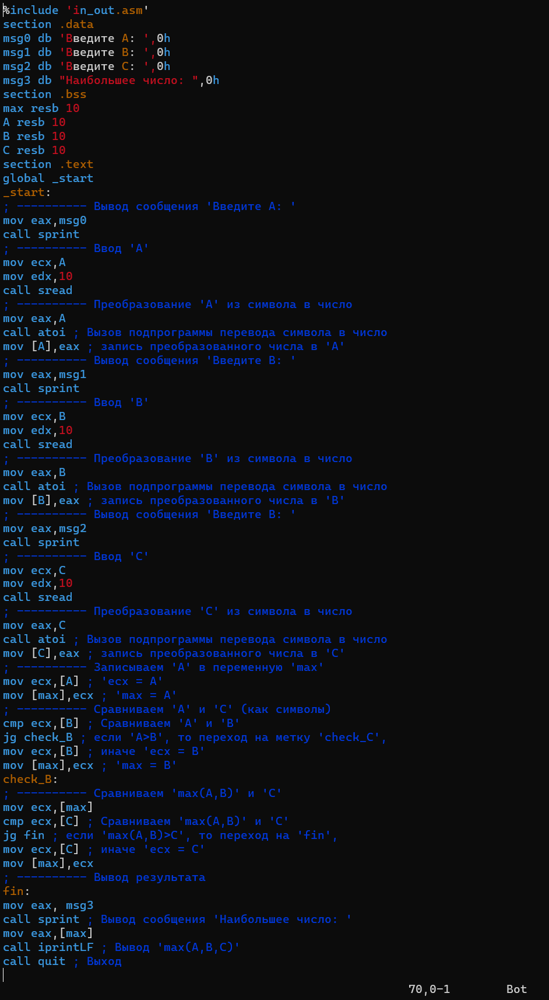{#fig:014 width=70%}

Собрал и ввёл данные своего номера (19) - работает как надо (после этого проверил и другие значения, тоже работает) (Рис. [-@fig:015])

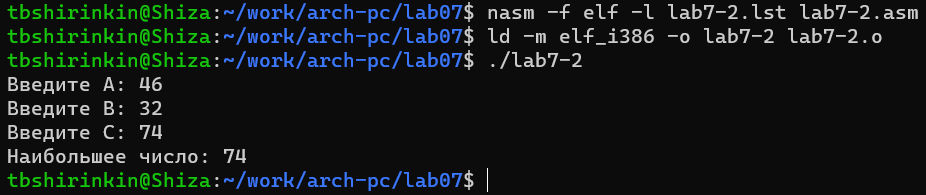{#fig:015 width=70%}

Создал текст второй программы (для номера 19) опять из программы lab7-2.asm (Рис. [-@fig:016])

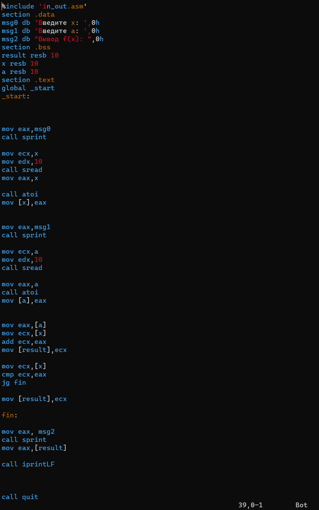{#fig:016 width=70%}

Снова собрал и снова ввёл данные своего номера (19) - работает как надо (после этого как и в прошлый раз проверил и другие значения, опять работает) (Рис. [-@fig:017])

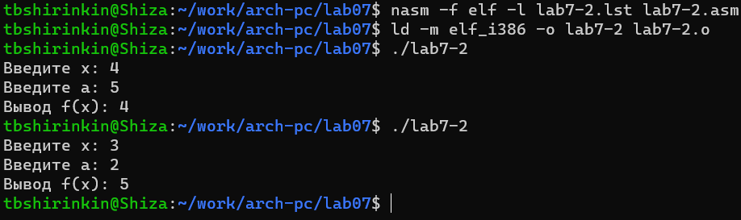{#fig:017 width=70%}

# Выводы

Цель достигнута: изучены команды условного и безусловного переходов в Nasm, условий порядка и изучены структуры листинга.